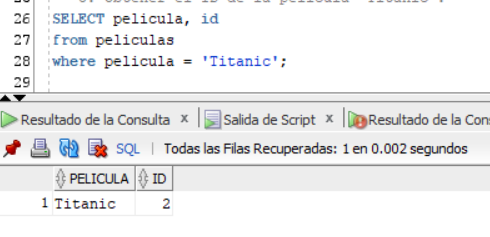
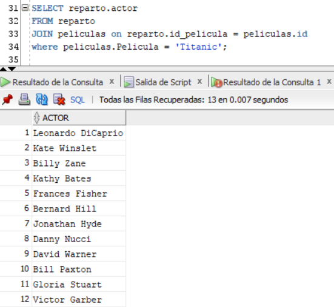
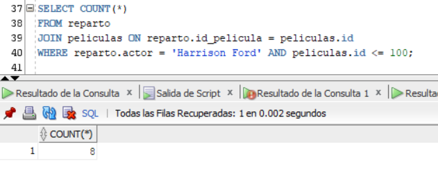
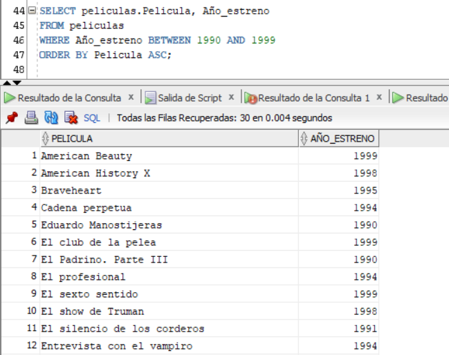
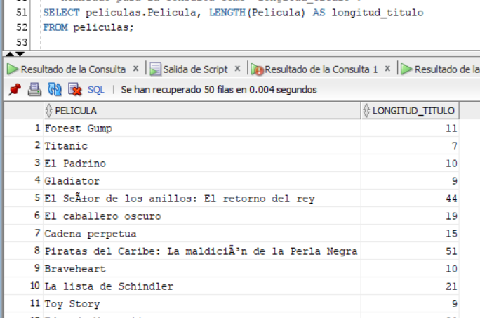
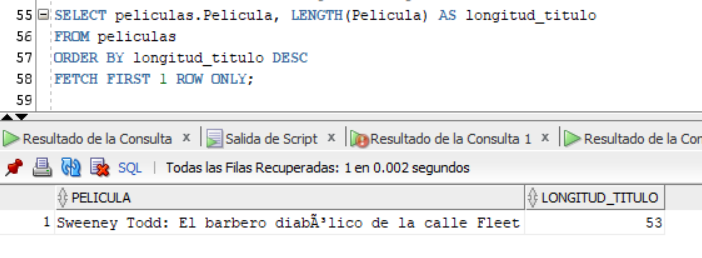

# Desafío - Definición de tablas

En este desafío se validan los conocimientos de definición de tablas.

## Captura de las consultas

3. Obtener el ID de la película “Titanic”.

4. Listar a todos los actores que aparecen en la película "Titanic".

5. Consultar en cuántas películas del top 100 participa Harrison Ford.

6. Indicar las películas estrenadas entre los años 1990 y 1999 ordenadas por título de manera ascendente.

7. Hacer una consulta SQL que muestre los títulos con su longitud, la longitud debe ser nombrado para la consulta como “longitud_titulo”.

8. Consultar cual es la longitud más grande entre todos los títulos de las películas.

